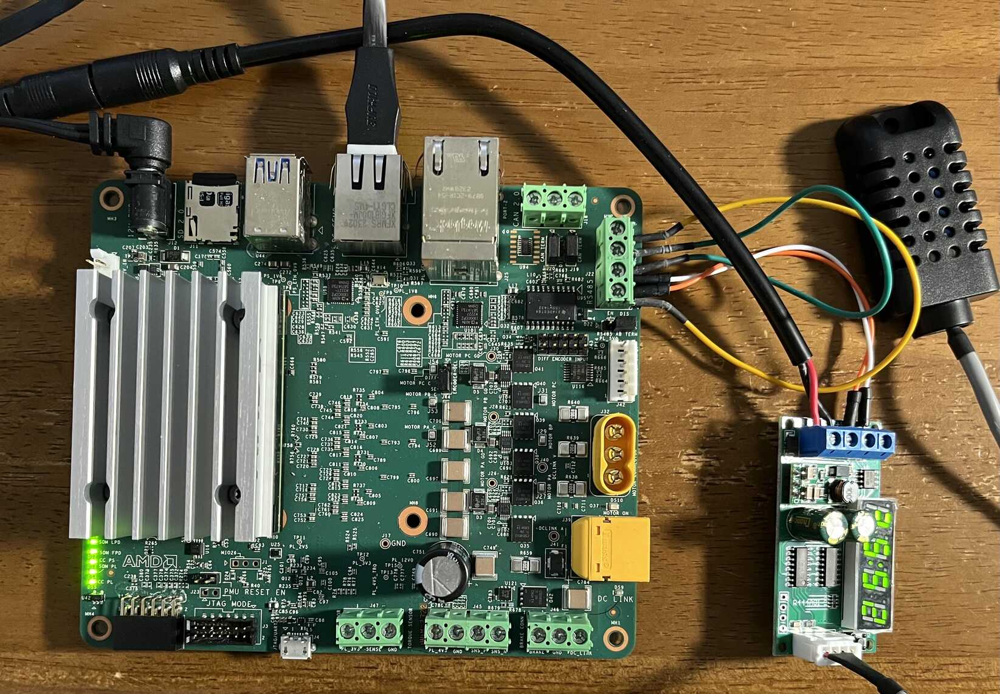

# Kd240Demo



## Confirm RS485

For device setup, follow [Communication using RS485](https://xilinx.github.io/kria-apps-docs/kd240/build/html/docs/ros2_multinode_communication_via_tsn/src/app_deployment.html#communication-using-rs485).

```elixir
iex(1)> {:ok, pid} = Circuits.UART.start_link
{:ok, #PID<0.1401.0>}
iex(2)> Circuits.UART.open(pid, "ttyPS0")
:ok
# MODBUS RTU の温湿度センサーに対し、 値読み出しのデータを送信
iex(3)> Circuits.UART.write(pid, <<1, 3, 0, 0, 0, 2, 196, 11>>)
:ok
# :circuits_uart メッセージとして返ってくる、応答を表示
iex(4)> flush
{:circuits_uart, "ttyPS0", <<1, 3, 4, 1, 27, 1, 251, 203, 219>>}
# <<temperature::16>> = <<1, 27>>, temperature は 281, 28.1℃
# <<humidity::16>> = <<1, 251>>, humidity は 507, 50.7%
```

## Targets

Nerves applications produce images for hardware targets based on the
`MIX_TARGET` environment variable. If `MIX_TARGET` is unset, `mix` builds an
image that runs on the host (e.g., your laptop). This is useful for executing
logic tests, running utilities, and debugging. Other targets are represented by
a short name like `kd240` that maps to a Nerves system image for that platform.
All of this logic is in the generated `mix.exs` and may be customized. For more
information about targets see:

https://hexdocs.pm/nerves/targets.html#content

## Getting Started

To start your Nerves app:

- `export MIX_TARGET=my_target` or prefix every command with
  `MIX_TARGET=my_target`. For example, `MIX_TARGET=kd240`
- Install dependencies with `mix deps.get`
- Create firmware with `mix firmware`
- Burn to an SD card with `mix burn`

## Learn more

- Official docs: https://hexdocs.pm/nerves/getting-started.html
- Official website: https://nerves-project.org/
- Forum: https://elixirforum.com/c/nerves-forum
- Discussion Slack elixir-lang #nerves ([Invite](https://elixir-slackin.herokuapp.com/))
- Source: https://github.com/nerves-project/nerves
